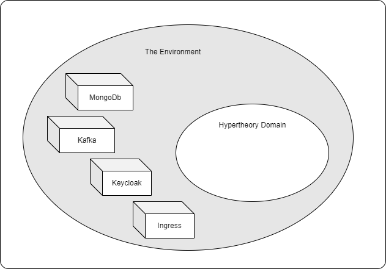

# Admin Deployments and Dev Environments

Our applications run within a domain, and within that domain a bounded context.

The `Environment` here, provides some ambient services. Usually stateful stuff that our application will _assume_ is available.

> An example of an Environment

## Different Environments

You will have multiple environments in which your application will run. For example,

- Local Dev Environment
- Shared Dev Environment
- QA / Testing Environment
- Staging Environment
- Production Environment

For this application, we will use a **Local Dev Environment**. That means all the _ambient_ resources that will be provided in other environments will be represented and provided here as well.

The use of a **Local Dev Environment** does not preclude the use of a **Shared Dev Environment**. However, it does allow an individual developer or team to stabilize new features, experiment, and, well, screw up, without having to first go through the necessary _process_ of setting up a shared environment.

> Note: Keycloak and an Ingress will not be used for this training. They are represented as examples here.
